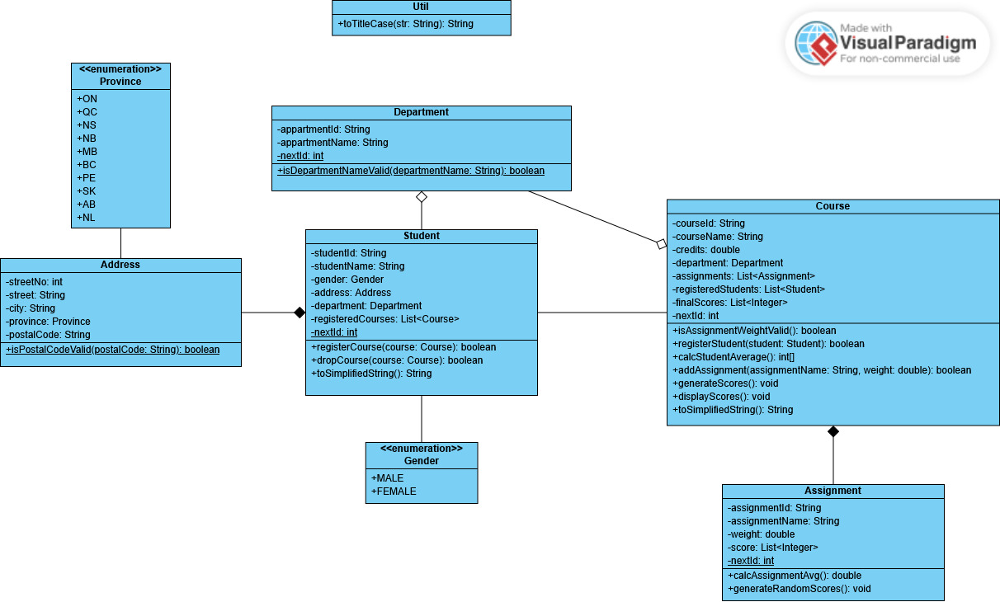

# Final Project

## Author: Anas Issa 2551365

This is the final project for the course Introduction to programming at Vanier college

### Explanation: 

This project is a Student Management System built with Java, designed using Object-Oriented Programming (OOP) principles and Lombok for clean code. It focuses on six core classes: Student, Course, Department, Address, Assignment, and Util. The system uses specific logic for generating unique IDs (ex: S000001), validating data (like the CDCDCD postal code format), and maintaining state relationships between students and courses. Its main function is to calculate final student grades using a weighted average of assignment scores. 

### UML Class Diagram:

